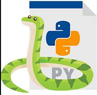

# Python-Exercises

Este repositorio contiene una colección de ejercicios básicos de Python diseñados para practicar distintas estructuras, funciones y conceptos del lenguaje. Cada archivo representa un ejercicio independiente.

## Ejercicios incluidos

Algunos de los ejercicios que encontrarás en este repositorio son:

- `appmovil_compras.py`
- `browser.py`
- `calculo_costo_total.py`
- `calculo_descuento.py`
- `calculo_numero_calorias.py`
- `consulta_BSD_edades.py`
- `definir_funcion_responsabilidad.py`
- `definir_una_funcion.py`
- `diccionario_de_elementos.py`
- `diccionario_de_elementos2.py`
- `diccionario_de_peliculas_y_valoraciones.py`
- `diccionario_de_vecinos.py`
- `ejecucion_pruebas_mensajes_error.py`
- `entorno.py`
- `f-strings.py`
- ...

> **Nota:** Puedes ver todos los ejercicios directamente en el repositorio.



## Requisitos

### Instalar Python

#### Windows

1. Descarga el instalador de Python desde [python.org/downloads](https://www.python.org/downloads/windows/)
2. Ejecuta el instalador y marca la opción **Add Python to PATH**.
3. Finaliza la instalación.
4. Verifica la instalación abriendo una terminal (cmd) y ejecutando:

    ```sh
    python --version
    ```

#### MacOS

1. Abre la Terminal.
2. Instala Homebrew (si no lo tienes):

    ```sh
    /bin/bash -c "$(curl -fsSL https://raw.githubusercontent.com/Homebrew/install/HEAD/install.sh)"
    ```

3. Instala Python con Homebrew:

    ```sh
    brew install python
    ```

4. Verifica la instalación:

    ```sh
    python3 --version
    ```

#### Linux (Debian/Ubuntu)

1. Abre una terminal.
2. Instala Python usando apt:

    ```sh
    sudo apt update
    sudo apt install python3
    ```

3. Verifica la instalación:

    ```sh
    python3 --version
    ```


## Clonar el repositorio

1. Abre una terminal o consola de comandos.
2. Ejecuta:

    ```sh
    git clone https://github.com/GitTestingPat/Python-Exercises.git
    ```

3. Entra al directorio:

    ```sh
    cd Python-Exercises
    ```

## Ejecución de los ejercicios

Cada archivo `.py` es un ejercicio independiente. Para ejecutarlos:

- **En Windows:**

    ```sh
    python nombre_del_archivo.py
    ```

- **En Mac o Linux:**

    ```sh
    python3 nombre_del_archivo.py
    ```

## Ejercicios destacados

- **calculo_descuento.py:** Calcula descuentos aplicados a compras.
- **diccionario_de_peliculas_y_valoraciones.py:** Gestiona un diccionario de películas y valoraciones.
- **lista_empleados.py:** Trabaja con listas y empleados.
- **f-strings.py:** Ejemplo del uso de f-strings en Python.

Para más detalles sobre cada ejercicio, consulta el código fuente directamente en el repositorio.

---

¿Necesitas ayuda para instalar Python o ejecutar algún ejercicio? Consulta la [documentación oficial de Python](https://docs.python.org/3/) o abre un [issue](https://github.com/GitTestingPat/Python-Exercises/issues) en el repositorio.
